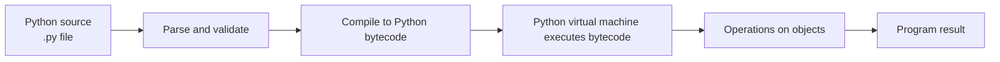
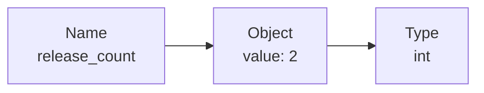

# Lesson 01 — How Python Executes Programs

**Status:** Completed  
**Module:** Python Foundations  
**Related issue:** GitHub Issue #4  
**Date started:** 2026-07-27  
**Date completed:** 2026-07-27

## Learning objective

Explain the relationship between Python source code, CPython, bytecode, runtime execution, values, objects, names, assignment, conversion, and types.

## Why it matters

Python syntax becomes easier to reason about when its execution model is clear. In particular, understanding that names bind to objects prevents common mistakes involving assignment, conversion, mutability, and type behaviour.

## Mental model



CPython is the most common implementation of the Python language. It normally parses and validates source, compiles valid source into Python bytecode, and executes that bytecode using its virtual machine.

The common statement “Python is interpreted and not compiled” is therefore incomplete. CPython normally performs both compilation and interpretation, while hiding most of that machinery from the developer.

## Values, objects, names, and types

Consider:

```python
release_count = 2
```

`release_count` is a name bound to an integer object. The object has a value, type, and identity during its lifetime.



Multiple names can bind to the same object:

```python
first = 10
second = first
```

Reassignment rebinds a name:

```python
first = 20
```

This does not modify the integer object referenced by `second`. At this point, `first` refers to `20` and `second` still refers to `10`.

## Built-in types and operations

Examples of core built-in types:

```python
release_count = 2          # int
failure_rate = 0.05        # float
release_name = "July"      # str
is_approved = True         # bool
approved_by = None         # NoneType
```

Types define which operations their objects support:

```python
2 + 3          # 5
"4" + "5"      # "45"
"4" * 3        # "444"
```

`str * int` is explicitly defined as string repetition. By contrast, `"4" + 3` raises `TypeError` because string addition with an integer is not defined and Python will not guess an implicit conversion.

In Python 3, `/` performs true division:

```python
5 / 2   # 2.5, a float
```

`//` performs floor division:

```python
5 // 2  # 2, an int
```

## Assignment and conversion

Assignment binds or rebinds a name to an object. It does not normally transform an existing object.

```python
ticket_count_text = "9"
ticket_count = int(ticket_count_text)
```

`int(ticket_count_text)` creates an integer object representing `9`. The original string object remains unchanged and is still referenced by `ticket_count_text`.

## Dynamic and strong typing

Python is dynamically typed:

- objects have types;
- names can be rebound to objects of different types;
- type checking happens primarily at runtime.

Python is also strongly typed:

- unsupported operations do not trigger guessed conversions;
- an operation succeeds only when the involved types define it.

Dynamic typing does not mean that types are absent or unimportant.

## Comparison with C# and .NET

| C# and .NET | Python and CPython |
|---|---|
| C# source | Python `.py` source |
| Intermediate Language | Python bytecode |
| Common Language Runtime | Python virtual machine |
| Variable has a declared static type | Name can bind to objects of different types |
| Compile-time type checking is central | Runtime type checking is central |

A Python virtual machine executes bytecode. A Python virtual environment instead isolates project dependencies and installed packages; it is not the runtime execution engine.

## Independent exercise

Vinay produced the following without generated code:

```python
tickets_per_release_text = "9"
tickets_per_release = int(tickets_per_release_text)
releases_per_month = 2
tickets_per_month = tickets_per_release * releases_per_month

print("Tickets per month:", tickets_per_month)
print(type(tickets_per_release_text))
print(type(tickets_per_release))
print(type(tickets_per_month))
```

Expected output:

```text
Tickets per month: 18
<class 'str'>
<class 'int'>
<class 'int'>
```

Vinay explained that conversion creates a new integer object and binds it to `tickets_per_release`; the original binding to `tickets_per_release_text` remains unchanged.

## Common mistakes corrected

- Treating names as permanently typed containers
- Saying Python is interpreted without recognising bytecode compilation
- Confusing the Python virtual machine with a virtual environment
- Assuming assignment changes the previously referenced object
- Assuming strong typing prohibits all operations involving two different types
- Assuming `+` performs numeric addition when both operands are strings
- Assuming `/` returns an integer when the result is mathematically whole

## Teach-back

Vinay's teach-back, lightly edited for spelling and grammar:

> CPython is the most common implementation of the Python language. It parses and validates code, converts it into bytecode, and executes it using the Python virtual machine. A name is bound to an object; for example, in `release_count = 5`, the object has the value `5` and the type `int`. Dynamic typing means a name can be rebound to objects of different types and type checking happens at runtime. Strong typing means Python does not silently guess conversions for unsupported operations such as `"5" + 4`.

## Reflection

### What became clearer

- How CPython converts source into bytecode and executes it
- How types and assignment work

### Most confusing point

- Why string multiplication by an integer is supported while string addition with an integer is not

The resolution is that types define their supported operations: string repetition by an integer is defined, while string addition with an integer is not.

### Remaining uncertainty

None recorded at lesson completion.
